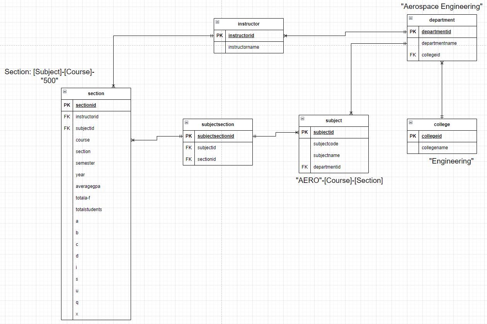

# Grade Distribution Data for AggieGrade

This repository contains a collection of grade distribution data used by [AggieGrade.com](https://aggiegrade.com).

## Data Source

The grade distribution data is publicly reported by the Texas A&M University Office of the Registrar. These reports include the grade distribution for the five most recent academic years. Note that course sections with fewer than 5 enrolled students are not included in these reports.

## Access to Public Reports

For more detailed information and to access the public grade distribution reports, visit the official Texas A&M website:

- [Texas A&M Grade Reports](https://web-as.tamu.edu/gradereports/)

## Data Processing

This project utilizes [Tabula](https://tabula.technology/) to convert the PDF reports into CSV format. The CSV files are then processed to filter out unnecessary columns or statistics, ensuring only the relevant data is used.

After the data is cleaned, it is inserted into an SQL database, which is used to power the React app that interacts with the grade distribution data.

The diagram above represents the structure and relationships used in the relational database that powers the grade distribution system. It highlights the key entities such as `Subjects`, `Departments`, `Instructors`, and `Sections`, along with their relationships. Each entity is linked to related data points, ensuring the database maintains referential integrity and allows efficient querying for the React frontend.

## Usage

The data in this repository is made available for educational and informational purposes. If you use this data, please cite the Texas A&M University Office of the Registrar as the source.

## Legal Information

This data is made publicly available in compliance with the **Texas Public Information Act (TPIA)**, outlined in **Texas Government Code, Chapter 552**. This act ensures public access to information held by government bodies, including public universities like Texas A&M.
